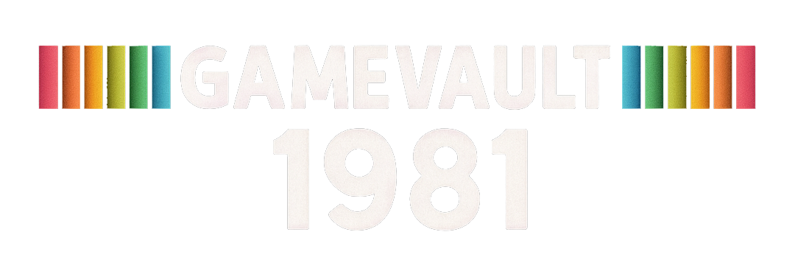
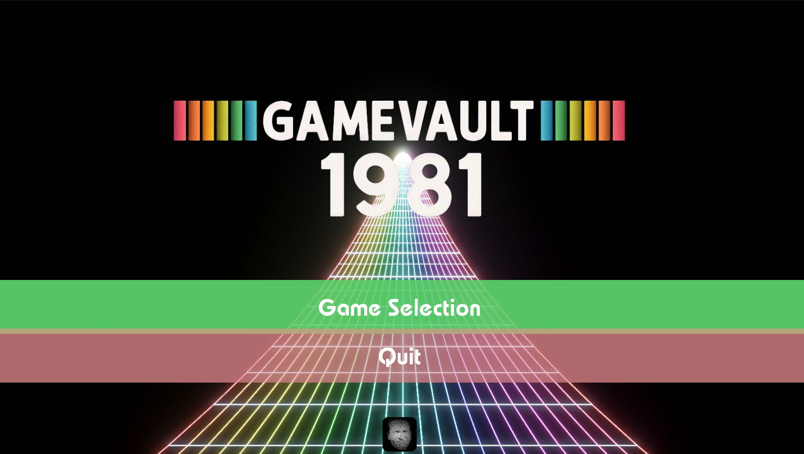
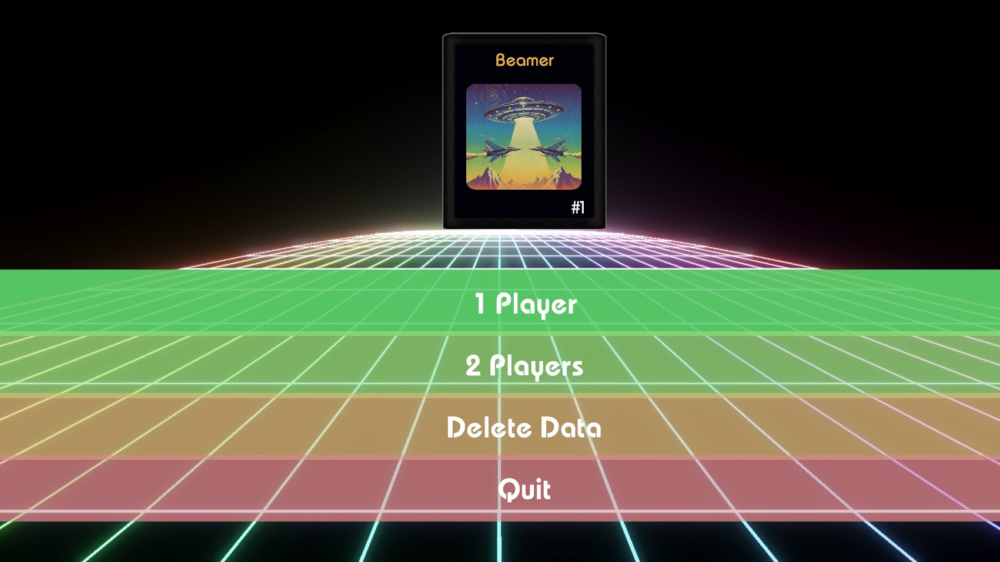
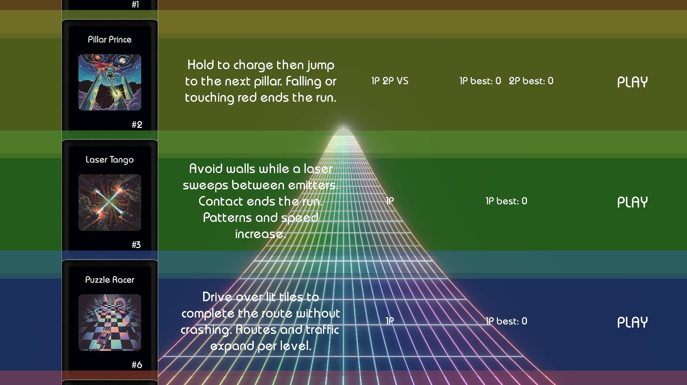
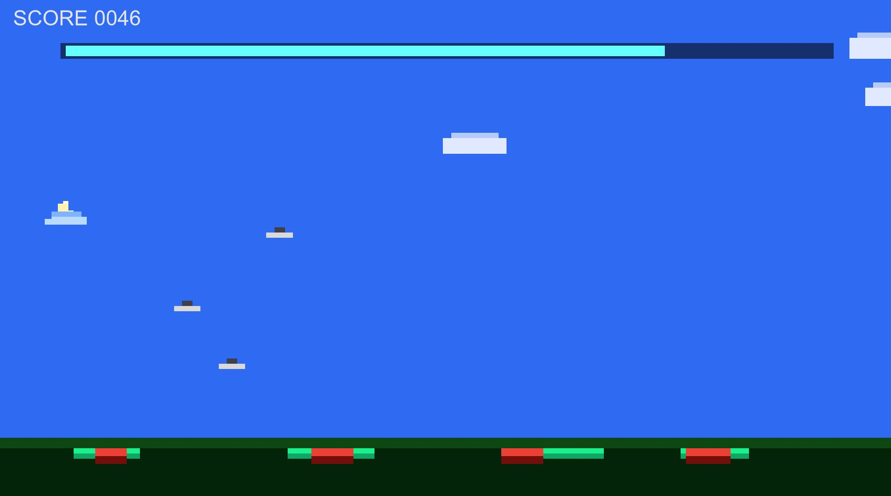

# Gamevault 1981

Gamevault 1981 is my small unfinished retro arcade collection game: a handful of Atari 2600-style games presented as a lost anthology. I decided to not finish at this time, as it was supposed to include 50-80 games, and use the concept for something else. TBA soon. 

This is a Windows download.

[Download the latest Windows build](https://github.com/pwlot/gamevault-1981/releases/latest) 
[My site](https://www.pwlot.com/)

## Included Games

- Beamer
- Pillar Prince
- Laser Tango
- Puzzle Racer
- RRBBYY
- Cannon Man
- Circulaire
- Ball Sort

## Screenshots

## Download

Windows builds are distributed through GitHub Releases. The Unity project source is not published here.

Latest release: [Gamevault 1981 releases](https://github.com/pwlot/gamevault-1981/releases/latest)

## Next

I also want to use Gamevault 1981 as seed material for a web-based Atari 2600-style game generation and LLM benchmark suite: tiny generated games, automated playability checks, curation, and model leaderboards.

## Publisher

Published by [Pawel Pachniewski / Pwlot](https://www.pwlot.com/).
